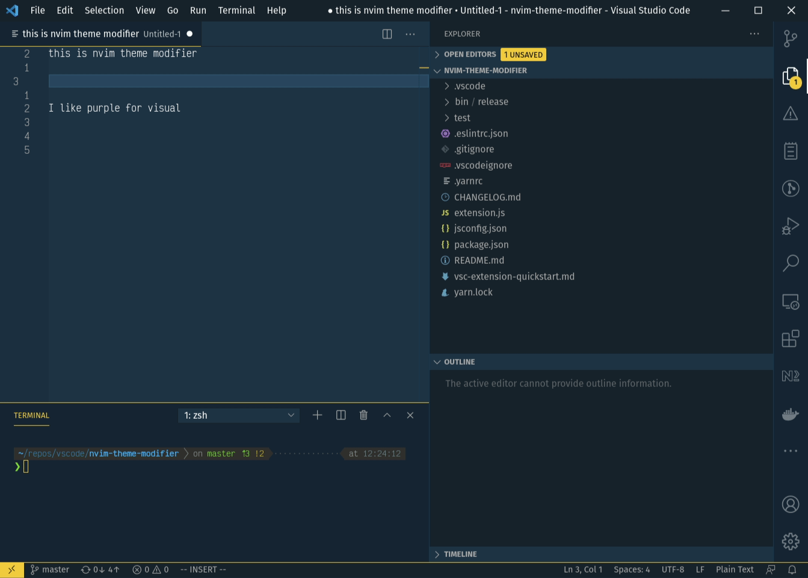

# NeoVim Ui Modifier

Changes theme accents based on current NeoVim mode.



Currently works for the following modes:

- Normal
- Insert
- Visual

Set the color for each mode to match your theme in settings.json (see below)

Also see the [Blog Article](https://dev.to/julian_e_yak_win_andi/vscode-neovim-theme-modifier-51gg)

# Requirements

You will need the NeoVim VScode extension installed for this to work - [Neovim Extension](https://marketplace.visualstudio.com/items?itemName=asvetliakov.vscode-neovim) - follow full setup before continuing

# Config

### In settings.json:

You can change the colors to match the theme you use:

```
    "nvim-theme.nvimColorNormal": "#ffc600",
    "nvim-theme.nvimColorInsert": "#D32F2F",
    "nvim-theme.nvimColorVisual": "#673AB7",
    "nvim-theme.nvimColorReplace": "#000"
```

By default the extension only changes the color of cursor. To change the color of other elements, add it's name to workbench.nvimColorCustomizationKeys in setings.json.

For example, if you would like the active tab highlight and cursor to change color, enter the following in settings.json:

```
    "workspace.nvimColorCustomizationKeys":  ["tab.activeBorder", "editorCursor.foreground"],
```

Here the elements that can be updated via this plugin:

activityBarBadge.background
editorCursor.foreground
inputValidation.errorBorder
panel.border
panelTitle.activeBorder
panelTitle.activeForeground
peekView.border
peekViewTitleLabel.foreground
tab.activeBorder
statusBar.border

### In Neovim config

This will need adding to you init.vim or init.lua, it tells neovim to send a command to vscode changing the color in a hacky way

Make sure to restart VSCode after adding

#### init.lua

```
vim.api.nvim_exec([[
    " THEME CHANGER
    function! SetCursorLineNrColorInsert(mode)
        " Insert mode: blue
        if a:mode == "i"
            call VSCodeNotify('nvim-theme.insert')

        " Replace mode: red
        elseif a:mode == "r"
            call VSCodeNotify('nvim-theme.replace')
        endif
    endfunction

    augroup CursorLineNrColorSwap
        autocmd!
        autocmd ModeChanged *:[vV\x16]* call VSCodeNotify('nvim-theme.visual')
        autocmd ModeChanged *:[R]* call VSCodeNotify('nvim-theme.replace')
        autocmd InsertEnter * call SetCursorLineNrColorInsert(v:insertmode)
        autocmd InsertLeave * call VSCodeNotify('nvim-theme.normal')
        autocmd CursorHold * call VSCodeNotify('nvim-theme.normal')
    augroup END
]], false)
```

#### init.vim

```
" THEME CHANGER
function! SetCursorLineNrColorInsert(mode)
    " Insert mode: blue
    if a:mode == "i"
        call VSCodeNotify('nvim-theme.insert')

    " Replace mode: red
    elseif a:mode == "r"
        call VSCodeNotify('nvim-theme.replace')
    endif
endfunction

augroup CursorLineNrColorSwap
    autocmd!
    autocmd ModeChanged *:[vV\x16]* call VSCodeNotify('nvim-theme.visual')
    autocmd ModeChanged *:[R]* call VSCodeNotify('nvim-theme.replace')
    autocmd InsertEnter * call SetCursorLineNrColorInsert(v:insertmode)
    autocmd InsertLeave * call VSCodeNotify('nvim-theme.normal')
    autocmd CursorHold * call VSCodeNotify('nvim-theme.normal')
augroup END
```

\*\* WARNING: The plugin will add / override any keys that are passed in for customization in settings.json. If uninstalling the extension you will need to remove these from your settings.json

```
"workbench.colorCustomizations": {
    ...keys
}
```
